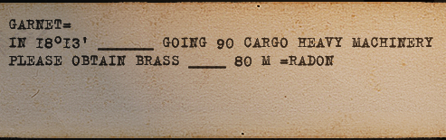
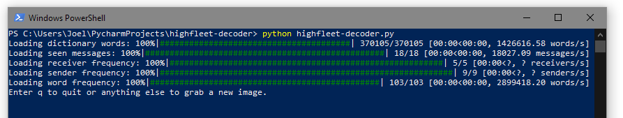

# highfleet-decoder

A command line interface for dealing with HighFleet radio intercepts.
* captures clear text or cipher text via OCR.
* track the frequency of words in clear text.
* generate cipher code differences by matching frequent word differences vs cipher words.
* helps translate a code difference to a code.

---

* [highfleet-decoder](#highfleet-decoder)
  * [Primer](#primer)
  * [Install](#install)
  * [Usage](#usage)
  * [Tips](#tips)
  * [Todo](#todo)
  * [License](#license)

---

## Primer

What are these messages, and how do they work? Check out this guide on YouTube:

## Install

1. download the source or clone the repo
2. For Windows, install tesseract, https://tesseract-ocr.github.io/tessdoc/Installation.html and add `C:\Program Files\Tesseract-OCR` to your `PATH` in your environment variables.
3. install `python`, the pipenv is set up for Python 3.11
4. install `pipenv`, `$ pip install pipenv`
5. use `pipenv sync` to create an environment and install dependencies.

## Usage

`$ pipenv run python highfleet-decoder.py`

* Follow onscreen prompts to
 * capture message
 * fix OCR
 * confirm if the message is clear or cipher text (it knows)
 * review code suggestions.

## Tips

The project is a rough prototype.

* Valid word characters are `strings.ascii_uppercase + strings.digits + "=-"`. I haven't dealt with dashed locations yet, probably will be treated as multiple words.
* HighFleet messages are in all caps. When correcting OCR text, your input will be transformed into uppercase.
* When correcting senders or receivers, the equals sign must be in the right place to be detected. Receivers and senders are kept separate from body words. 
* Senders and receivers must be last and first. If there is OCR text after, you should blank it or swap positions with other text.
* `1` and `I` look the same in HighFleet's font. The project tries to deal with this by determining if the rest of the word is primarily numbers or letters.
* Are the suggestions actually solutions?
  * Depends on the frequency list being populated somewhat.
  * Assuming that unique words have unique difference patterns 

## Todo

* Finding edge cases by running campaigns.
* Ability to have different frequency sets for starting clean with a new campaign, if desired.
* Add unit tests.
* Add CI, preferably in CircleCI, since I've used it.
* Refactor code into not one big file.
* Screenshots.
* Colour output.
* Arguments and argument parsing?
* `pypi` package?

## License

[BSD-3-Clause license](./LICENSE)

`words_alpha.txt` used under "Unlicense license", [dwyl/english-words](https://github.com/dwyl/english-words)
